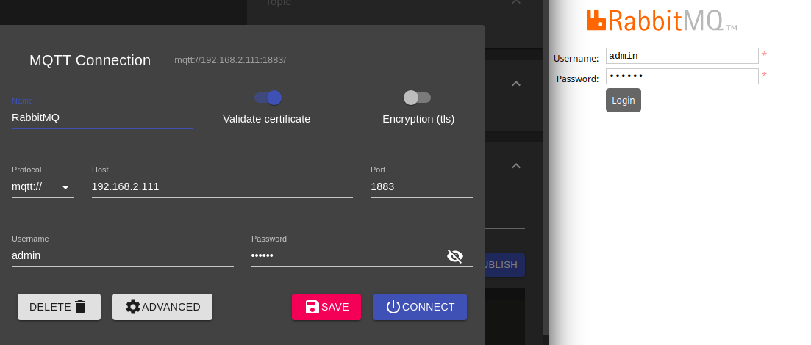

# RabbitMQ Docker

Run a Rabbit Message Que using Docker and Docker-Compose. Install all [necessary plugins](https://www.rabbitmq.com/protocols.html) to use RabbitMQ as your MQTT Broker and connect to with your client software either using the MQTT or AMQP protocol over a websocket connection.


## Run

Run the container with the following command to be able to see the container log for debugging. The container will expose 

```bash
docker-compose up

Starting rabbitmq ... done
Attaching to rabbitmq
rabbitmq    | Enabling plugins on node rabbit@1a7c322456fc:
rabbitmq    | rabbitmq_mqtt
rabbitmq    | rabbitmq_web_mqtt
rabbitmq    | rabbitmq_amqp1_0
rabbitmq    | The following plugins have been configured:
rabbitmq    |   rabbitmq_amqp1_0
rabbitmq    |   rabbitmq_management
rabbitmq    |   rabbitmq_management_agent
rabbitmq    |   rabbitmq_mqtt
rabbitmq    |   rabbitmq_prometheus
rabbitmq    |   rabbitmq_web_dispatch
rabbitmq    |   rabbitmq_web_mqtt
rabbitmq    |   ##  ##      RabbitMQ 3.9.14
rabbitmq    |   ##  ##
rabbitmq    |   ##########  Copyright (c) 2007-2022 VMware, Inc. or its affiliates.
rabbitmq    |   ######  ##
rabbitmq    |   ##########  Licensed under the MPL 2.0. Website: https://rabbitmq.com
rabbitmq    | 
rabbitmq    |   Erlang:      24.3.3 [jit]
rabbitmq    |   TLS Library: OpenSSL - OpenSSL 1.1.1n  15 Mar 2022
rabbitmq    | 
rabbitmq    |   Doc guides:  https://rabbitmq.com/documentation.html
rabbitmq    |   Support:     https://rabbitmq.com/contact.html
rabbitmq    |   Tutorials:   https://rabbitmq.com/getstarted.html
rabbitmq    |   Monitoring:  https://rabbitmq.com/monitoring.html
rabbitmq    | 
rabbitmq    |   Logs: /var/log/rabbitmq/rabbit@1a7c322456fc_upgrade.log
rabbitmq    |         <stdout>
rabbitmq    | 
rabbitmq    |   Config file(s): /etc/rabbitmq/advanced.config
rabbitmq    |                   /etc/rabbitmq/rabbitmq.conf
rabbitmq    |                   /etc/rabbitmq/conf.d/10-defaults.conf
```


```bash
docker exec -ti rabbitmq rabbitmq-diagnostics status

Plugins

Enabled plugin file: /etc/rabbitmq/enabled_plugins
Enabled plugins:

 * rabbitmq_prometheus
 * prometheus
 * rabbitmq_amqp1_0
 * accept
 * rabbitmq_web_mqtt
 * rabbitmq_mqtt
 * rabbitmq_management
 * amqp_client
 * rabbitmq_web_dispatch
 * cowboy
 * cowlib
 * rabbitmq_management_agent

Config files

 * /etc/rabbitmq/advanced.config
 * /etc/rabbitmq/rabbitmq.conf
 * /etc/rabbitmq/conf.d/10-defaults.conf

Listeners

Interface: [::], port: 15672, protocol: http, purpose: HTTP API
Interface: [::], port: 1883, protocol: mqtt, purpose: MQTT
Interface: [::], port: 15675, protocol: http/web-mqtt, purpose: MQTT over WebSockets
Interface: [::], port: 15692, protocol: http/prometheus, purpose: Prometheus exporter API over HTTP
Interface: [::], port: 25672, protocol: clustering, purpose: inter-node and CLI tool communication
Interface: [::], port: 5672, protocol: amqp, purpose: AMQP 0-9-1 and AMQP 1.0
```


## Connections

Check the `./docker-compose.yml` file for the published ports:


| Service | Exposed Port |
| -- | -- |
| __AMQP__ | `5672` |
| __Management__ | `8080` |
| __MQTT__ | `1883` |
| __WebSocket__ | `1885` |


You can access the webinterface on port `8080` and connect to the MQTT Broker on port 1883 - both use default login specified in `./config/login.env`:





MQTT over WebSocket can be accessed at `ws://server-address:1885/ws`.


Once everything is working use the `-d` flag to detached the container from your console:

```bash
docker-compose up -d
```